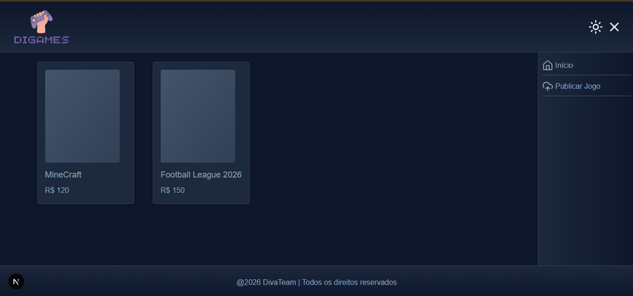
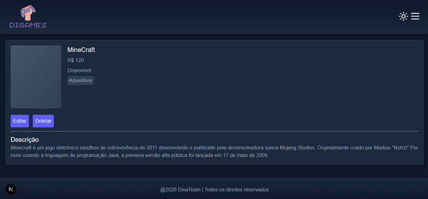
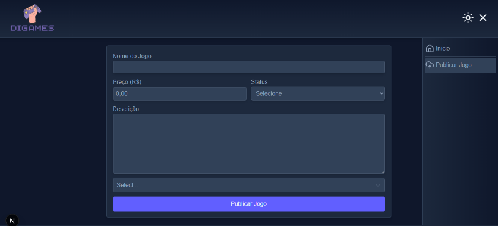
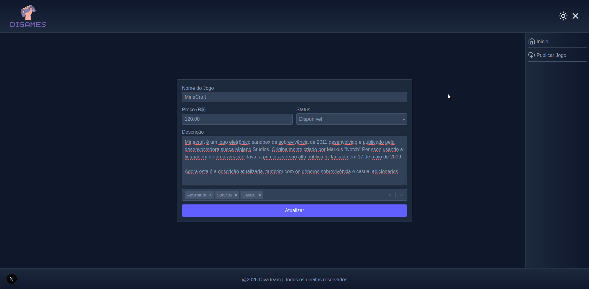

# 🎮 DiGames

Loja de games simples feita em FastAPI + Next.js.


## Requisitos
- Python 3
- Node.js | npm

## Setup rápido

**Backend:**

<details>
	<summary>Linux</summary>

```bash
cd backend
python3 -m venv venv
source ./venv/bin/activate
pip install -r requirements.txt
fastapi dev
```
</details>

<details>
	<summary>Windows</summary>

```bash
cd backend
python -m venv venv
.\venv\Scripts\activate
pip install -r requirements.txt
fastapi dev
```
</details>


**Frontend:**
```bash
cd frontend
npm install
npm run dev
```

Acesse em `http://localhost:3000` — a loja já vai listar os jogos da API.

## O que faz

- Loja com grid de games (clica em qualquer um pra ver detalhes)
- Adiciona, edita e remove jogos
- Filtra por gênero
- Dark/Light mode
- Responsive

## API (FastAPI)

Base: `http://localhost:8000`

| Método | Rota | O que faz |
|--------|------|----------|
| GET | `/jogos` | Lista todos os jogos |
| GET | `/jogos/{id}` | Detalhes de um jogo |
| GET | `/generos` | Lista de gêneros |
| POST | `/generos` | Adiciona gênero |
| POST | `/jogos` | Cria jogo |
| PUT | `/jogos/{id}` | Atualiza campos |
| DELETE | `/jogos/{id}` | Deleta jogo |
| DELETE | `/generos/{id}` | Deleta gênero |


## Tech

- **Backend**: Python + FastAPI + SQLAlchemy (SQLite)
- **Frontend**: Next.js 16 + React 19 + TailwindCSS
- **Tema**: next-themes (dark/light)
- **Extras**: axios, lucide-react, sweetalert2, react-select


## Prints




